# Atarimae

**当たり前のことが、当たり前にできる社内掲示板。**

小さな会社が自分のサーバーに置いて使う、連絡・確認・チャットのための
オープンソースアプリです。無料、人数制限なし。スマートフォン、PC、Windows
アプリから同じアカウントと同じ機能を使えます。

📖 **English: [README.en.md](README.en.md)**

## ひとつの場所でできること

- **公告** — 全員向けの本文と、一人ひとりの担当を一度に配信
- **確認** — 誰が何を読んだかを記録し、現在有効な確認義務だけを集計
- **組織管理** — 部署、メンバー、管理者、権限、複数端末のセッション
- **チャットと通話** — 部署ごとの自動グループ、一対一、画像・ファイル、メンション、通話
- **グループ管理** — 管理者のみ投稿、メンバーごとの発言停止
- **スマートフォンと PC** — PWA、Web Push、オフライン閲覧、Windows アプリ
- **連携** — OpenAPI 3.1、サービスアカウント、署名付き Webhook
- **運用** — 監査ログ、CSV、添付を含むバックアップと検証付き復元

管理者が別の管理者を追加できます。一つのアカウントを複数端末で使えます。
会社が入力したデータは、会社自身が取り出せます。申請、人数別プラン、公式クラウドは
ありません。

## 画面

同じデモデータを、管理者とメンバー、PC とスマートフォンで実際に操作しています。

### 管理者

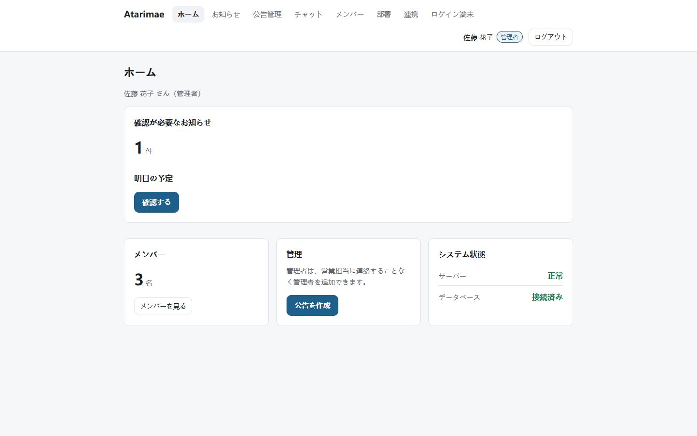

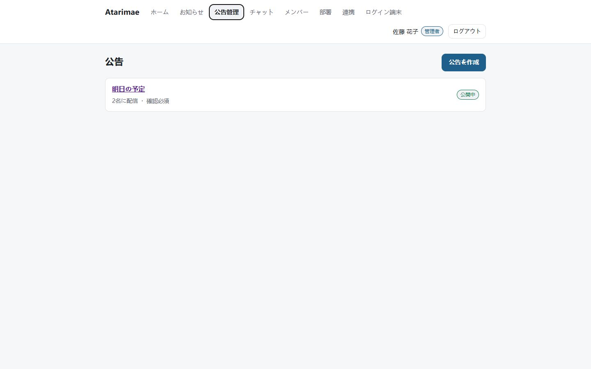

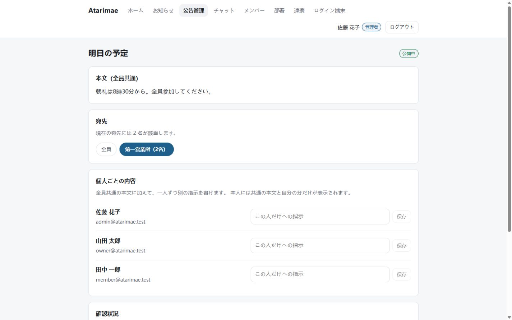

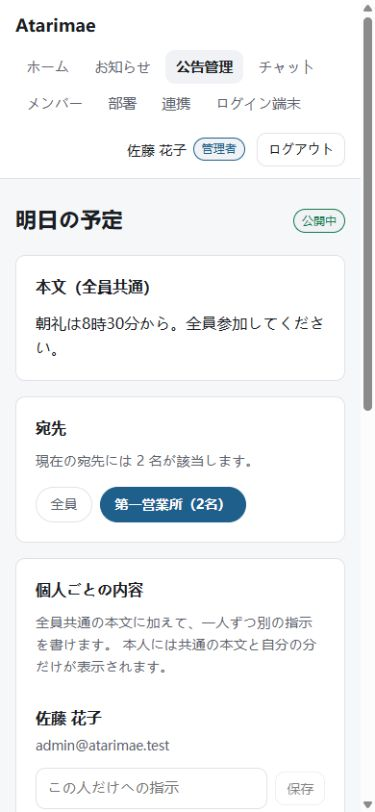

#### 一対一チャット

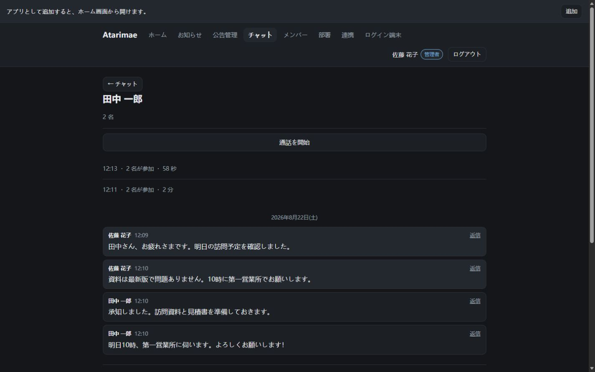

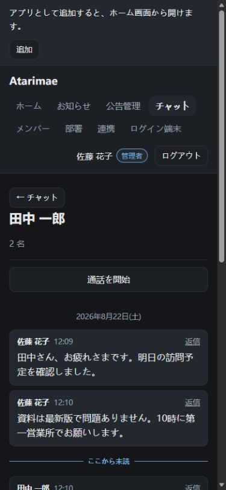

#### 通話

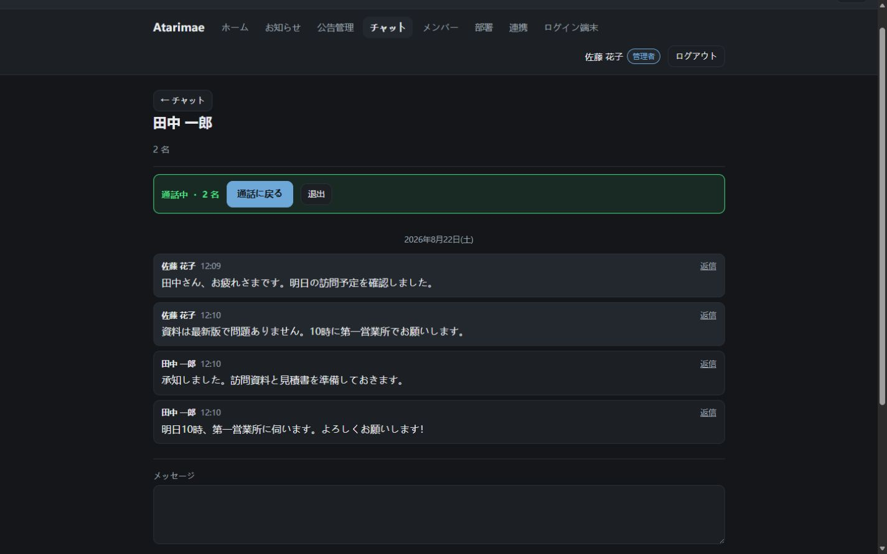

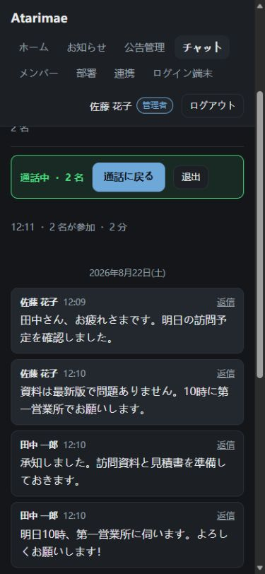

### メンバー

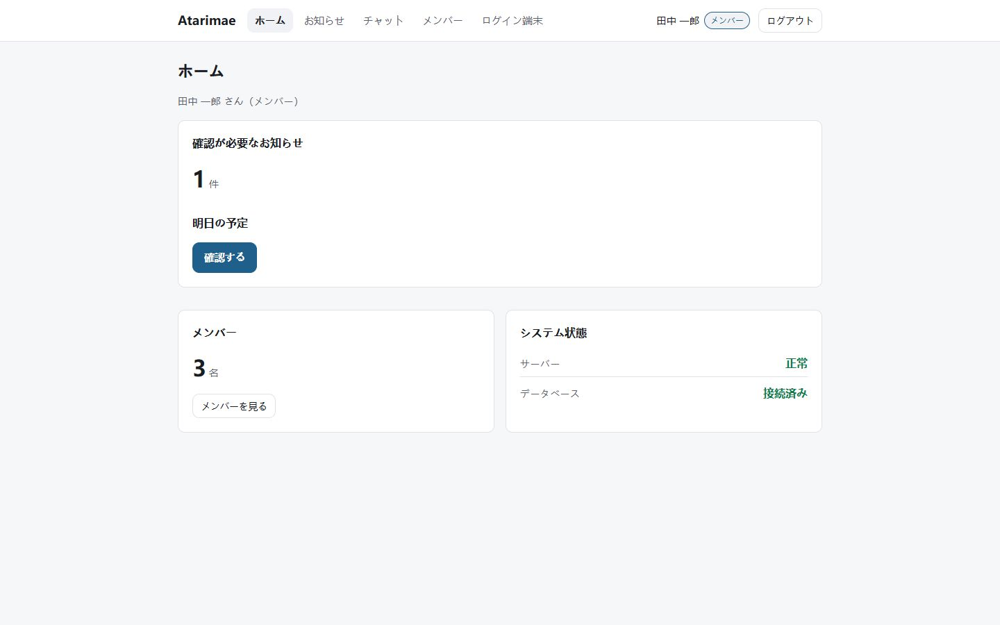

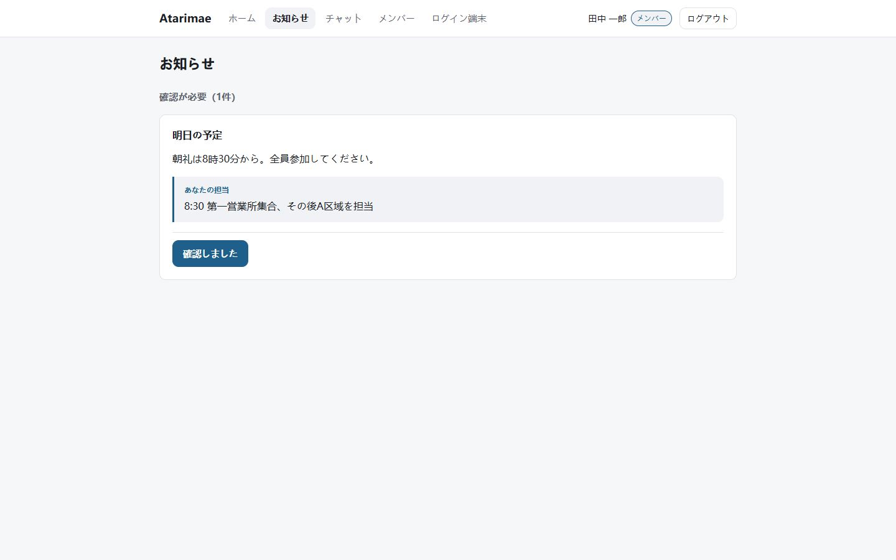

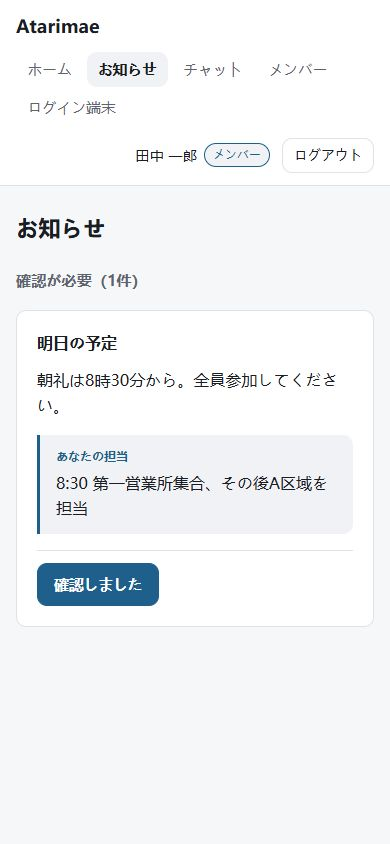

#### 一対一チャット

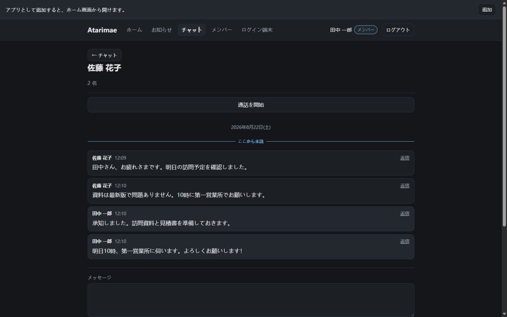

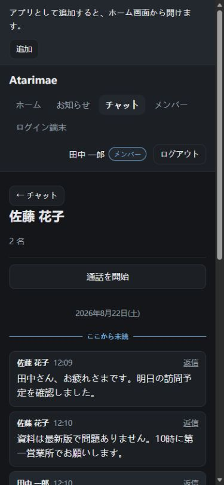

#### 通話

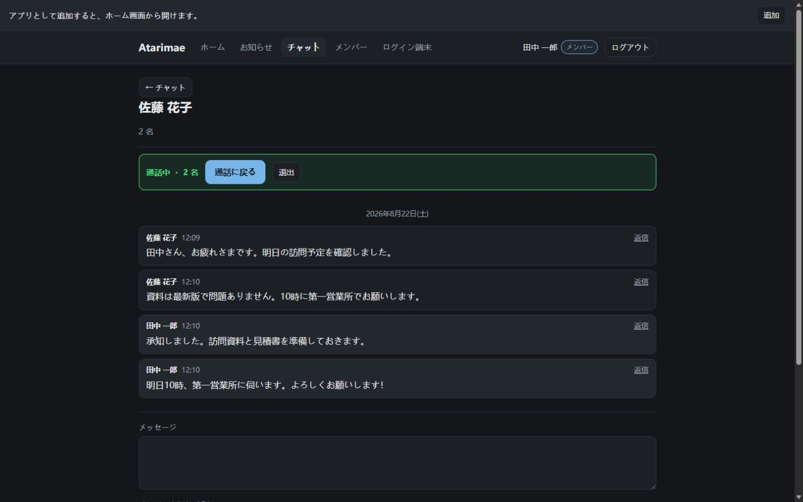

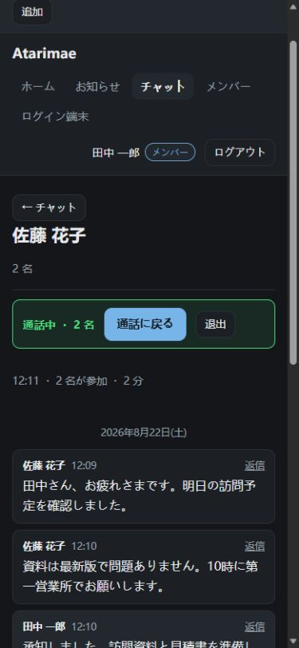

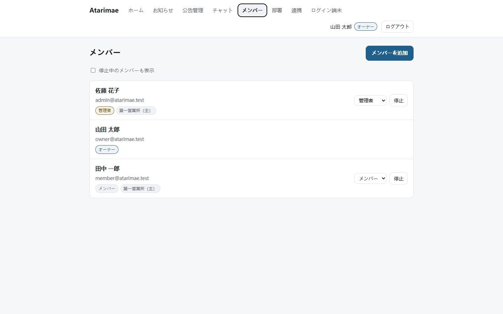

## すぐに使う

### Windows（推奨）

ZIP を展開し、ルートにある **`install-windows.cmd` をダブルクリック**してください。
日本語の画面が Docker Desktop の確認・インストール、暗号鍵の生成、データベース、
HTTPS、起動確認まで進めます。既存の設定と暗号鍵は再実行しても上書きしません。

- 「このPCだけで試用」は、追加の入力なしで `localhost` を開きます。
- 「会社で利用」は、利用するドメイン名を1つ入力します。DNS とルーターの
  80/443 転送だけはPC外部の設定なので、セットアップ画面が確認項目を表示します。

### サーバーを手動で構築する場合

必要なものは Docker Compose と TLS を終端するリバースプロキシです。

```bash
git clone https://github.com/Astomzx/atarimae.git
cd atarimae
node scripts/setup-env.mjs
```

生成された `.env` の `PUBLIC_ORIGIN` を、利用者が開く HTTPS のアドレスに変更します。
その後は一つのコマンドで、イメージの構築、データベースの準備、アプリの起動まで
完了します。

```bash
docker compose up -d --build
```

`PUBLIC_ORIGIN` を開き、最初のオーナーを作成してください。別の有効化手続きは
ありません。以後の再起動と更新でも、未適用のデータベース変更は起動前に自動で
適用されます。

TLS、リバースプロキシ、SMTP、バックアップ、更新については
**[Docker 運用ガイド](docs/deployment/docker.md)** にまとまっています。

> `.env` の `ENCRYPTION_KEY_CURRENT` は、データベースのバックアップとは別の安全な
> 場所に保管してください。失うと、保存済みの外部資格情報を復号できません。

## 使い方

### 管理者

1. 組織とメンバーを登録し、必要な人だけに管理権限を付けます。
2. 公告を作り、部署または個人を宛先にします。必要なら CSV で個別担当をまとめて
   入力します。
3. 公開後は確認状況を画面または CSV で確認します。対象者が一人もいない操作を
   成功として扱うことはありません。

### メンバー

ログインすると、自分に必要な公告、個別の担当、未読のチャットが一つのホームに
表示されます。公告は共通本文と自分向け内容を読んでから確認します。取得済みの公告は
オフラインでも読めますが、取得時刻が必ず表示され、オフライン中の確認操作は
記録されません。

## 運用

更新はソースを取得して、同じ起動コマンドを実行するだけです。

```bash
git pull
docker compose up -d --build
```

バックアップはデータベースと添付ファイルを一つの検証済み書庫にまとめます。

```bash
docker compose exec app node packages/backup/dist/cli.js backup \
  --out /var/lib/atarimae/backups/atarimae.tar.gz
```

確認と復元のコマンド、暗号化、定期実行は
[Docker 運用ガイド](docs/deployment/docker.md#backups)を参照してください。

## 開発

Node.js 22 以上、pnpm 10 以上、PostgreSQL 18 以上を使います。

```bash
pnpm install
node scripts/setup-env.mjs
pnpm db:reset
pnpm dev
```

変更を提出する前の共通ゲートは `pnpm check`、画面やルートを変更した場合は
`pnpm test:e2e` です。設計、デプロイ、これまでに見つかった不具合と再発防止テストは
[docs/](docs/) に分けてあります。

| 場所           | 内容                                                 |
| -------------- | ---------------------------------------------------- |
| `apps/server`  | Fastify、REST / OpenAPI、WebSocket                   |
| `apps/web`     | React、Vite、TanStack Query                          |
| `apps/desktop` | 同じ Web アプリを表示する Tauri Windows クライアント |
| `packages`     | API スキーマ、秘密情報、バックアップの共有パッケージ |
| `migrations`   | 上りと下りを持つ PostgreSQL マイグレーション         |
| `e2e`          | PC とスマートフォン幅の Playwright シナリオ          |

## 大切にしていること

- **黙って成功しない。** 誰にも作用しない操作は、成功ではなく理由を返します。
- **確認できる。** 重要な制約にはテストがあり、CI は単体、E2E、Windows、
  本番コンテナを検査します。
- **データを閉じ込めない。** CSV、OpenAPI、Webhook、バックアップを提供します。
- **端末で機能を分けない。** スマートフォンと PC は同じ製品です。
- **日本語を先に考える。** 画面は日本語、README は日本語と英語を同じ内容で
  維持します。

設計の理由を知りたい場合は、まず
[公告モデル](docs/architecture/announcement-model.md)、
[セキュリティ](docs/architecture/security.md)、
[バックアップ](docs/architecture/backup.md)を参照してください。

## セキュリティ、ライセンス、サポート

脆弱性は公開 Issue ではなく、[SECURITY.md](SECURITY.md) の方法で非公開に報告して
ください。

ライセンスは [AGPL-3.0-only](LICENSE) です。自由に利用、改変、自己運用できます。
改変版をネットワークサービスとして提供する場合は、その版のソースを利用者に提供する
必要があります。

本プロジェクトは個人が作品および技術検証として維持しています。公式ホスティング、
SLA、個別の無償導入支援はありません。再現可能なバグ、文書改善、汎用的な機能提案、
Pull Request は歓迎します。
